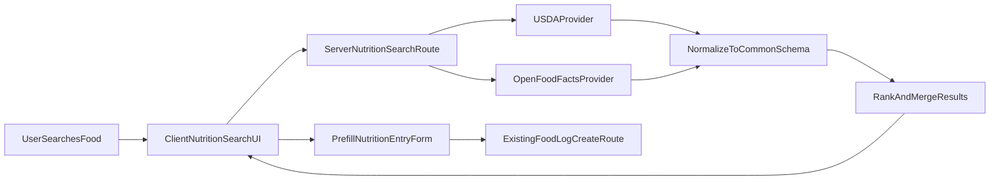

# Nutrition Search Strategy (MVP)

## Decision Context

- You chose: **balanced coverage** (whole foods + branded products) and **full flow** (select result -> prefilled nutrition entry form).
- Existing app already has nutrition logging CRUD at [client/src/pages/Nutrition.jsx](/Users/nicholaschan/Desktop/Project-New-FitnessApp/client/src/pages/Nutrition.jsx) and [server/routes/foodLogs.js](/Users/nicholaschan/Desktop/Project-New-FitnessApp/server/routes/foodLogs.js).

## Option Comparison

### Option A: Build/curate our own nutrition DB

- **Pros**: full control, no third-party dependency.
- **Cons**: heavy data acquisition/cleanup, update burden, legal/licensing risk, weak coverage initially.
- **Verdict**: not good for MVP speed/accuracy.

### Option B: Single external API only (USDA or OpenFoodFacts)

- **Pros**: simple backend integration.
- **Cons**: one source misses either generic foods (OFF) or branded/global products (USDA limitations by region).
- **Verdict**: workable, but weaker for your "balanced" goal.

### Option C (Recommended): Hybrid free providers behind one server endpoint

- **Primary source**: USDA FoodData Central for generic/whole foods (good nutrient quality, per-100g basis, free key).
- **Secondary source**: OpenFoodFacts for branded/packaged items (free open dataset, many products, per-100g fields often available).
- **Backend unification**: one internal search API that normalizes both providers into one response schema.
- **Verdict**: best balance of quality + breadth while staying free.

## Recommended Architecture (Option C)

## API Shape to Implement

- New server route: `GET /api/nutrition/search?q=...&limit=...`
- Response item shape (normalized):
  - `source` (`usda` | `openfoodfacts`)
  - `externalId`
  - `name`
  - `brand` (nullable)
  - `per100g`: `{ calories, proteinG, carbsG, fatG }`
  - `servingInfo` (optional)
  - `qualityFlags` (missingMacros, estimated, etc.)

## UX Flow (Full Flow)

1. User types food query in Nutrition page.
2. Results list shows per-100g macros/calories.
3. User selects a result.
4. App opens/expands existing add-entry form prefilled (calories/macros + food name note/label).
5. User edits grams/notes/date and saves to existing `POST /api/food-logs` flow.

## Security/Operational Notes

- Keep provider API key(s) server-only in env (never client-side).
- Add small in-memory cache + timeout/retry to avoid rate-limit spikes.
- Log source/provider failures and gracefully return partial results.

## Rollout Plan

1. Backend provider adapters + normalized search endpoint.
2. Client nutrition search UI and result list.
3. Prefill integration with existing add-entry form.
4. Basic ranking + fallback behavior.
5. Smoke tests and docs update in [docs/FEATURES.md](/Users/nicholaschan/Desktop/Project-New-FitnessApp/docs/FEATURES.md).

## Acceptance Criteria

- Query returns mixed-source results in under ~1.5s typical.
- Each visible result includes calories/protein/carbs/fat per 100g (or explicit missing marker).
- Selecting a result pre-fills add-entry form and saves correctly.
- Existing manual entry still works unchanged.

## Later Stage: AI-Assisted Dish Breakdown (Post-MVP)

- Goal: allow a conversational AI flow like **"What did you eat today?"** where user answers with a dish name.
- AI role: parse dish text into probable ingredients and portions (draft interpretation).
- Validation role (source of truth): call nutrition providers/API for each parsed ingredient and compute totals from provider data, not AI-estimated nutrition.
- Why this matters: AI helps with convenience and parsing, but nutrition values should remain API-backed for reliability and traceability.
- Scope note: this is explicitly **later-stage** and does not block the current MVP nutrition search rollout.

## Backlog Todos

- [ ] Add provider adapters and unified `/api/nutrition/search` route with normalized per-100g response.
- [ ] Add nutrition search UI on Nutrition page and render ranked mixed-source results.
- [ ] Prefill existing add-entry form from selected search result and keep edit-before-save behavior.
- [ ] Add timeouts/cache/error fallback for provider reliability and rate limits.
- [ ] Update `FEATURES.md` with nutrition-search behavior and source strategy.
- [ ] Add post-MVP AI flow where AI parses dish text into ingredients, then validate nutrition via APIs before logging.
